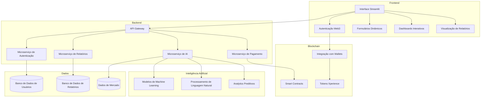
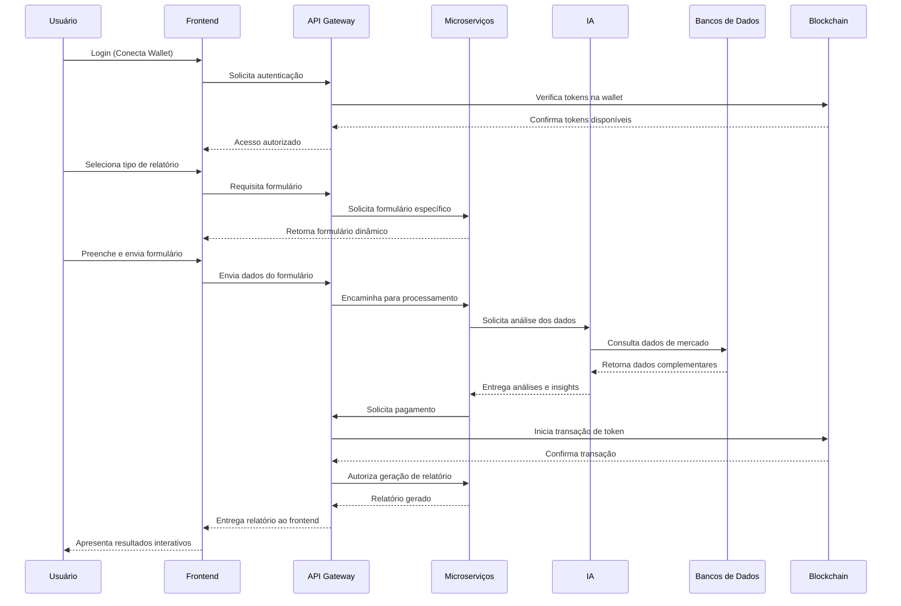

# Arquitetura da IA do Empreendedor

## Visão Geral

A IA do Empreendedor é uma plataforma baseada em Inteligência Artificial que ajuda empreendedores a identificar oportunidades de mercado, utilizando a teoria do Oceano Azul. A arquitetura é projetada para ser escalável, modular e segura, permitindo a fácil integração de novos recursos e serviços.

## Diagrama de Arquitetura

## Componentes Principais

### 1. Frontend (Streamlit)

- **Interface do Usuário**: Desenvolvida com Streamlit para criar uma experiência interativa e responsiva.
- **Componentes Utilizados**:
  - ChatBox: Para interações conversacionais com a IA
  - ApexCharts: Para visualizações gráficas avançadas
  - Streamlit Elements: Para componentes de UI avançados

### 2. Backend (Microserviços)

- **API Gateway**: Gerencia todas as requisições externas e direciona para os microserviços apropriados.
- **Microserviços**:
  - **Autenticação**: Gerencia login via smart wallets e controle de acesso.
  - **Relatórios**: Processamento e geração dos diferentes tipos de relatórios.
  - **IA**: Executa os algoritmos de análise e gera insights estratégicos.
  - **Pagamento**: Gerencia transações de tokens Xperience na blockchain.

### 3. Camada de Dados

- **Bancos de Dados**:
  - **DB de Usuários**: Armazena informações de perfil e preferências.
  - **DB de Relatórios**: Mantém histórico e conteúdo de relatórios gerados.
  - **DB de Mercado**: Armazena dados de mercado para análise comparativa.
- **Tecnologias Recomendadas**:
  - MongoDB para dados não estruturados
  - PostgreSQL para dados relacionais
  - Amazon S3 para armazenamento de arquivos

### 4. Camada de Inteligência Artificial

- **Modelos de Machine Learning**:
  - Análise preditiva de mercados
  - Identificação de padrões em dados setoriais
  - Recomendações estratégicas personalizadas
- **Processamento de Linguagem Natural**:
  - Análise de sentimento de feedbacks de clientes
  - Processamento de pesquisas de mercado
  - Geração de conteúdo para relatórios
- **Analytics Preditivos**:
  - Previsão de tendências de mercado
  - Modelagem de cenários estratégicos
  - Otimização de decisões de negócio

### 5. Integração Blockchain

- **Smart Contracts**: Gerenciam a emissão e transação de tokens Xperience.
- **Integração com Wallets**: Suporte a Metamask, WalletConnect e outras carteiras populares.
- **Tokens Xperience**: Utilizados como meio de pagamento para acesso aos relatórios.

## Fluxo de Dados

## Detalhamento dos Microserviços

### Microserviço de Autenticação
- **Responsabilidades**: Gestão de identidade, autenticação Web3, controle de acesso.
- **Tecnologias**: Web3.js, JWT para sessões, OAuth para integrações.

### Microserviço de Relatórios
- **Responsabilidades**: Geração e armazenamento de relatórios, templates dinâmicos.
- **Tipos de Relatórios**:
  - Mapa do Seu Negócio
  - Relatório Xperience (Oceano Azul)
  - Relatório SEO

### Microserviço de IA
- **Responsabilidades**: Processamento de dados, análises preditivas, geração de insights.
- **Frameworks**: TensorFlow/PyTorch para ML, Hugging Face para NLP.

### Microserviço de Pagamento
- **Responsabilidades**: Gestão de transações de tokens, verificação de saldo.
- **Tecnologias**: Web3.js, Ethers.js, integração com smart contracts.

## Considerações de Escalabilidade

- **Containerização**: Todos os microserviços são containerizados com Docker.
- **Orquestração**: Kubernetes para gerenciamento dos containers.
- **Balanceamento de Carga**: Implementação de load balancers para distribuir requisições.
- **Cache**: Utilização de Redis para caching de dados frequentemente acessados.

## Considerações de Segurança

- **Autenticação Web3**: Uso de assinaturas criptográficas para autenticação segura.
- **HTTPS**: Toda comunicação externa é criptografada.
- **Controle de Acesso**: Implementação de RBAC (Role-Based Access Control).
- **Proteção de Dados**: Criptografia de dados sensíveis em repouso e em trânsito.
- **Auditorias**: Logs de auditoria para todas as operações críticas.

## Roadmap de Implementação

### Fase 1: MVP
1. Implementação da interface básica com Streamlit
2. Desenvolvimento do microserviço de autenticação Web3
3. Implementação do primeiro relatório (Mapa do Seu Negócio)
4. Integração com blockchain para pagamentos

### Fase 2: Expansão
1. Adição de relatórios adicionais
2. Implementação dos modelos de IA avançados
3. Melhorias na experiência do usuário
4. Otimização de performance

### Fase 3: Plataforma Completa
1. Implementação de todos os microserviços
2. Integração com APIs externas para dados de mercado
3. Implementação de recursos avançados de IA
4. Expansão para múltiplos setores de mercado

## Recomendações Técnicas

1. **Desenvolvimento Modular**: Priorizar a criação de componentes independentes e reutilizáveis.
2. **API-First**: Desenvolver APIs bem documentadas antes da implementação dos serviços.
3. **Testes Automatizados**: Implementar CI/CD com cobertura de testes para garantir qualidade.
4. **Monitoramento**: Implementar ferramentas de observabilidade como Prometheus e Grafana.
5. **Documentação**: Manter documentação técnica atualizada para facilitar a integração de novos desenvolvedores.
