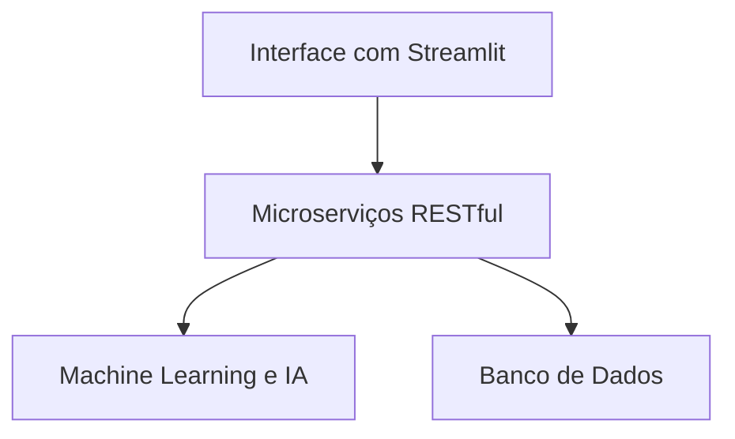
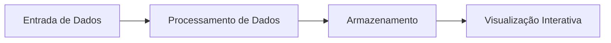
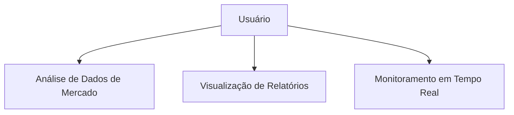
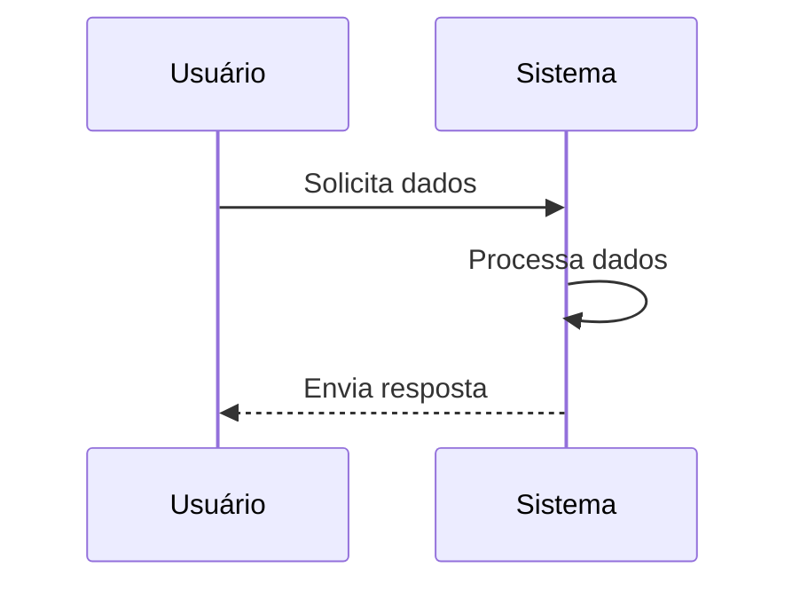
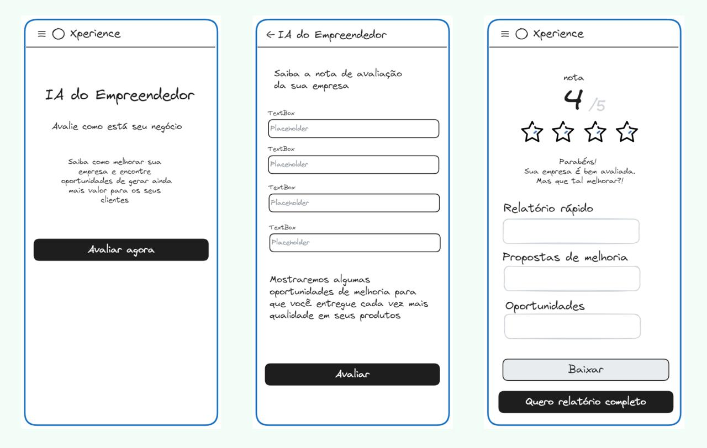

# ai-for-entrepreneurs

# IA do Empreendedor

Uma ferramenta de Inteligência Artificial projetada para empoderar empreendedores, transformando dados em insights estratégicos para a tomada de decisões mais seguras. Baseada na teoria do Oceano Azul, a plataforma identifica oportunidades inexploradas e cria novos espaços de mercado, ajudando empresas a inovar sem a pressão da concorrência tradicional.


## Sumário

- [Introdução](#introdução)
- [Objetivos](#objetivos)
- [Funcionalidades](#funcionalidades)
- [Diagramas](#diagramas)
- [Arquitetura e Tecnologias](#arquitetura-e-tecnologias)
- [Soluções Integradas](#soluções-integradas)
- [Aplicações Setoriais](#aplicações-setoriais)
- [Benefícios Estratégicos](#benefícios-estratégicos)
- [Próximos Passos](#próximos-passos)
- [Contribuição](#contribuição)
- [Contato](#contato)


## Introdução

A IA do Empreendedor foi desenvolvida para empoderar os líderes de negócio, utilizando inteligência artificial para transformar grandes volumes de dados em insights estratégicos. Ao unir tecnologias inovadoras e os princípios da estratégia do Oceano Azul, o projeto possibilita a criação de novos espaços de mercado e a redução dos riscos inerentes à inovação.

## Objetivos

- Automatizar análises de mercado detalhadas.
- Gerar insights preditivos para orientar decisões estratégicas e operacionais.
- Facilitar o acesso a informações críticas que impulsionem o sucesso do negócio.

## Funcionalidades

- **Análise de Dados de Mercado:** Processamento avançado de informações para identificar tendências e oportunidades inexploradas.
- **Relatórios Interativos:** Dashboards dinâmicos como o Mapa do Seu Negócio, Relatório Xperience e Relatório SEO.
- **Monitoramento em Tempo Real:** Acompanhamento contínuo de indicadores e métricas essenciais.
- **Personalização de Dashboards:** Visualizações customizadas que se adaptam ao perfil e às necessidades específicas do negócio.
- **Integração com APIs:** Conexão com diversos serviços que fortalecem o ecossistema Xperience.

## Diagramas

### Diagrama de Arquitetura

*Este diagrama ilustra a arquitetura geral da IA do Empreendedor, mostrando como os diferentes componentes interagem entre si.*

### Diagrama de Fluxo de Dados

*Este diagrama representa o fluxo de dados dentro da plataforma, detalhando como as informações são processadas e utilizadas para gerar insights.*

### Diagrama de Casos de Uso

*Este diagrama apresenta os principais casos de uso da plataforma, destacando as interações entre os usuários e o sistema.*

### Diagrama de Sequência

*Este diagrama mostra a sequência de interações entre os componentes do sistema para realizar uma tarefa específica.*

## Arquitetura e Tecnologias

- **Microserviços RESTful:** Arquitetura escalável e de fácil manutenção.
- **Machine Learning e IA:** Frameworks modernos aplicados para análises preditivas e processamento inteligente de dados.
- **Banco de Dados Robusto:** Estrutura de armazenamento que suporta grandes volumes de informações.
- **Interface com Streamlit:** Visualizações interativas que facilitam a interpretação dos dados e a integração com o ecossistema do projeto.

## Soluções Integradas

A IA do Empreendedor alimenta diversas soluções estratégicas dentro do ecossistema Xperience:

- **Mapa do Seu Negócio:** Dashboard que mapeia a situação atual da empresa e identifica áreas para crescimento.
- **Relatório Xperience:** Aplicação dos princípios do Oceano Azul para explorar novos mercados e orientar decisões estratégicas.
- **Relatório SEO:** Ferramenta que otimiza a presença digital, monitorando tráfego e métricas chave para melhorar o posicionamento online.

## Aplicações Setoriais

A plataforma adapta-se às necessidades específicas de diferentes setores:

- **Varejo e E-commerce:** Previsão de tendências, otimização de preços e gestão inteligente de estoques.
- **Serviços Profissionais:** Identificação de nichos, precificação baseada em valor e automação de processos.
- **Agronegócio:** Monitoramento de mercados internacionais, cadeia de suprimentos, e previsão de demanda.

## Benefícios Estratégicos

- **Reengenharia e Automação:** Redesenho dos processos internos para maior eficiência e inovação.
- **Transformação Digital:** Aceleração na implementação de tecnologias que abrem novos espaços de mercado.
- **Inovação Contínua:** Processos estruturados para a contínua geração e validação de ideias inovadoras.
- **Empoderamento das Equipes:** Ferramentas visuais e insights estratégicos que fortalecem a capacidade decisória dos colaboradores.

## Streamlit components

- [x] ChatBox: https://github.com/liunux4odoo/streamlit-chatbox
- [x] Gráficos: https://github.com/drogbadvc/streamlit-apexcharts
- [x] Elements: https://github.com/okld/streamlit-elements

## Próximos Passos

- Realizar um diagnóstico do posicionamento atual do negócio.
- Priorizar áreas para aplicação da estratégia do Oceano Azul.
- Implementar a plataforma de forma faseada, iniciando por módulos com maior impacto.
- Estabelecer métricas para monitorar o sucesso e o impacto das inovações implementadas.
- Promover a capacitação contínua da equipe para maximizar o potencial da plataforma.

## Contribuição

Contribuições são sempre bem-vindas! Para sugerir melhorias, reportar problemas ou enviar pull requests, consulte as diretrizes do repositório e participe ativamente do desenvolvimento.

## Contato

Para mais informações, entre em contato com a equipe responsável ou acesse o [repositório oficial](#) para detalhes adicionais.

## Instalação e Execução

### Pré-requisitos
- Python 3.9+ 
- pip (gerenciador de pacotes do Python)
- Git

### 1. Clone o repositório
```bash
git clone https://github.com/seu-usuario/ai-for-entrepreneurs.git
cd ai-for-entrepreneurs
```

### 2. Configuração do ambiente

#### Opção 1: Utilizando o script de configuração (recomendado)
Para Linux/macOS:
```bash
# Torne o script executável
chmod +x setup.sh
# Execute o script de configuração
./setup.sh
```

Este script irá:
- Verificar a versão do Python
- Criar um ambiente virtual
- Instalar todas as dependências
- Configurar a estrutura de diretórios correta
- Criar o arquivo .env a partir do .env.example

#### Opção 2: Configuração manual

##### Crie e ative um ambiente virtual
```bash
# Para Linux/macOS
python -m venv venv
source venv/bin/activate

# Para Windows
python -m venv venv
venv\Scripts\activate
```

##### Instale as dependências
```bash
pip install -r requirements.txt
```

##### Prepare a estrutura do projeto
```bash
# Criar __init__.py nos diretórios para que sejam reconhecidos como pacotes Python
mkdir -p app/components
touch app/__init__.py
touch app/components/__init__.py
```

### 3. Configuração de variáveis de ambiente
Crie um arquivo `.env` na raiz do projeto baseado no modelo `.env.example`:

```bash
cp .env.example .env
# Edite o arquivo .env com suas configurações
```

### 4. Execute a aplicação
```bash
streamlit run app.py
```

A aplicação estará disponível em http://localhost:8501

### 5. Verificação da Instalação

Após iniciar a aplicação, você deverá ver uma interface semelhante a esta:



Se você encontrar algum problema, consulte a seção "Solução de Problemas" abaixo.

### Estrutura de Diretórios
```
ai-for-entrepreneurs/
├── app/
│   ├── __init__.py
│   ├── components/
│   │   ├── __init__.py
│   │   ├── dashboard.py
│   │   ├── business_map.py
│   │   ├── chat.py
│   │   ├── web3_auth.py
│   │   └── advanced_charts.py
│   ├── api/
│   ├── blockchain/
│   ├── core/
│   ├── data/
│   ├── models/
│   └── utils/
├── assets/
├── tests/
├── .env.example
├── .env
├── app.py
├── requirements.txt
├── setup.sh
└── README.md
```

### Solução de Problemas

#### Erro: No module named 'app.components'
Se você encontrar este erro, certifique-se de:
1. Ter criado os arquivos `__init__.py` em cada diretório conforme indicado acima
2. Estar executando a aplicação a partir da raiz do projeto
3. Ter instalado todas as dependências corretamente

#### Erro ao executar gráficos com streamlit-elements
Certifique-se de que o pacote `streamlit-elements` está instalado corretamente:
```bash
pip install streamlit-elements
```

Para melhor desempenho, instale o módulo Watchdog conforme recomendado:
```bash
# Para macOS
xcode-select --install
pip install watchdog

# Para outros sistemas
pip install watchdog
```

#### Configuração do Web3
A integração com Web3/Metamask requer configurações adicionais se você estiver trabalhando com blockchains reais. Consulte a documentação do pacote `web3` para mais detalhes.

